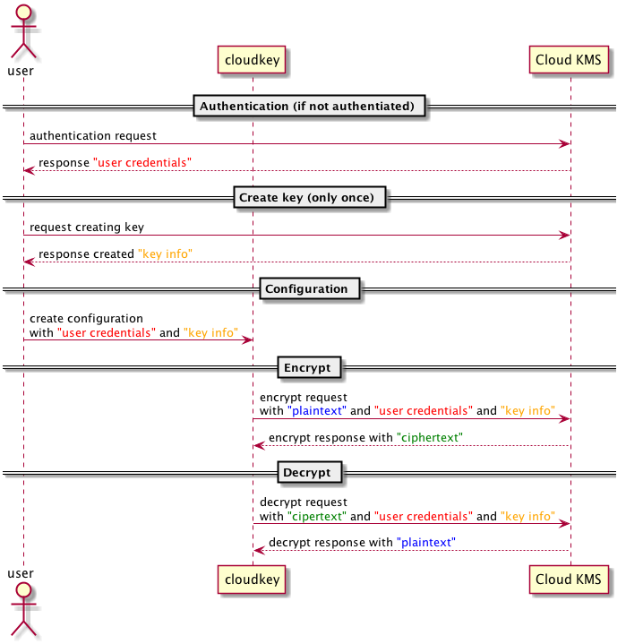

# cloudkey

* This is a program that encrypts and decrypts using the cloud's key management service such as GCP and AWS.
* With this program, encryption and decryption can be done securely without managing the encryption key locally.

# Usage

## Overview

1. Create GCP or AWS account.
1. Start using Key Management Service.
1. Install cloudkey
1. Create cloudkey configuration.
1. Encrypt and decrypt your files.



## Create GCP or AWS account

* Do it.

## Start using Key Management Service

### GCP

* [Document](https://cloud.google.com/kms/docs/quickstart?hl=en)
* Please note this item as you will need it later.
  * Project name 
  * Location (e.g. "global")
  * Keyring name (e.g. "test")
  * Key name (e.g. quickstart)

### AWS

* [Document](http://docs.aws.amazon.com/en_en/kms/latest/developerguide/getting-started.html)
* Please note this item as you will need it later.
  * Region (e.g. "us-west-2")
  * Key ID (e.g. "arn:aws:kms:us-west-2:111122223333:key/1234abcd-12ab-34cd-56ef-1234567890ab")

## Install

```bash
go install github.com/nirasan/cloudkey
```

## Create cloudkey configuration

### GCP

#### Login with account authenticated with gcloud command.

* Login with gcloud

```
gcloud auth application-default login
```

* Create configuration.

```
cloudkey config gcp gcloud-account --project PROJECT_NAME --location LOCATION --keyring KEYRING_NAME --key KEY_NAME CONFIG_FILE
```

#### Login with service account

* Create service account and download json key file

* Create configuration.

```
cloudkey config gcp service-account --project PROJECT_NAME --location LOCATION --keyring KEYRING_NAME --key KEY_NAME --service-account-key SERVICE_ACCOUNT_JSON_KEY_FILE CONFIG_FILE
```

### AWS

#### Login with credentials file

* [Hwo to create credentials](http://docs.aws.amazon.com/en_en/cli/latest/userguide/cli-chap-getting-started.html)

* Create configuration.

```
cloudkey config aws shared-creds --cred-file CREDENTIAL_FILE(default: ~/.aws/credentials) --profile PROFILE(default: default) --region REGION --key KEY_ID CONFIG_FILE
```

#### Login with static credentials

* Get credentials in some way.

* Create configuration.

```
cloudkey config aws static-creds --access-key-id ACCESS_KEY_ID --secret-access-key SECRET_ACCESS_KEY --access-token ACCESS_TOKEN --region REGION --key KEY_ID CONFIG_FILE
```

## Encrypt and decrypt your files

* Encrypt file

```
# GCP
cloudkey encrypt gcp --config CONFIG_FILE --extension EXTENSION(default: .crypted) TARGET_FILE
# AWS
cloudkey encrypt aws --config CONFIG_FILE --extension EXTENSION(default: .crypted) TARGET_FILE
```

* Decrypt file

```
# GCP
cloudkey decrypt gcp --config CONFIG_FILE --extension EXTENSION(default: .crypted) TARGET_FILE
# AWS
cloudkey decrypt aws --config CONFIG_FILE --extension EXTENSION(default: .crypted) TARGET_FILE
```

* Re-encrypt files. Encrypt if there is already encrypted file under specified directory.

```
# GCP
cloudkey re-encrypt gcp --config CONFIG_FILE --extension EXTENSION(default: .crypted) TARGET_DIR
# AWS
cloudkey re-encrypt aws --config CONFIG_FILE --extension EXTENSION(default: .crypted) TARGET_DIR
```

* Re-decrypt files. Decrypt if there is already encrypted file under specified directory.

```
# GCP
cloudkey re-decrypt gcp --config CONFIG_FILE --extension EXTENSION(default: .crypted) TARGET_DIR
# AWS
cloudkey re-decrypt aws --config CONFIG_FILE --extension EXTENSION(default: .crypted) TARGET_DIR
```
